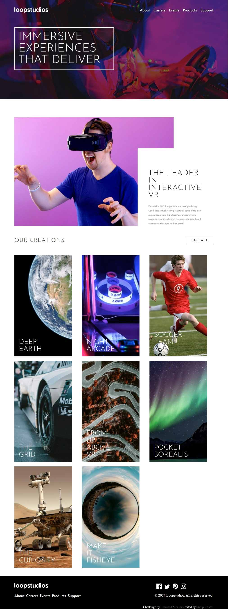
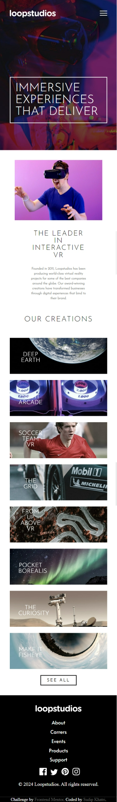

# Frontend Mentor - Loopstudios landing page solution

This is a solution to the [Loopstudios landing page challenge on Frontend Mentor](https://www.frontendmentor.io/challenges/loopstudios-landing-page-N88J5Onjw). Frontend Mentor challenges help you improve your coding skills by building realistic projects.

## Table of contents

- [Overview](#overview)
  - [The challenge](#the-challenge)
  - [Screenshot](#screenshot)
  - [Links](#links)
- [My process](#my-process)
  - [Built with](#built-with)
  - [What I learned](#what-i-learned)
  - [Continued development](#continued-development)
- [Author](#author)

## Overview

### The challenge

Users should be able to:

- View the optimal layout for the site depending on their device's screen size
- See hover states for all interactive elements on the page

### Screenshot

### Links

- Solution URL: [https://www.frontendmentor.io/solutions/responsive-loopsstudio-landing-page-using-html-css-and-javascript-Qx_k60qwN7](https://www.frontendmentor.io/solutions/responsive-loopsstudio-landing-page-using-html-css-and-javascript-Qx_k60qwN7)
- Live Site URL: [https://loopstudiosfrontendmentor.netlify.app/](https://loopstudiosfrontendmentor.netlify.app/)

## My process

### Built with

- Semantic HTML5 markup
- CSS custom properties
- Flexbox
- CSS Grid
- [AOS](https://michalsnik.github.io/aos/) - JS library For Animation

### What I learned

I learned Manipulation of src in specific width of devices. Alos learned (AOS) Animation On Scroll.

### Continued development

I will continue honing my skills in web development more and more. Also continue devleopment in Making website responsive, maintainable and write efficient code .

## Author

- Website - [@Sudip khatri](https://sudipkhatri.netlify.app/)
- Frontend Mentor - [@SudipKhatri036](https://www.frontendmentor.io/profile/SudipKhatri036)
- Linkedin - [@SudipKhatri](https://www.linkedin.com/in/sudip-khatri-a72a6a27b/)
